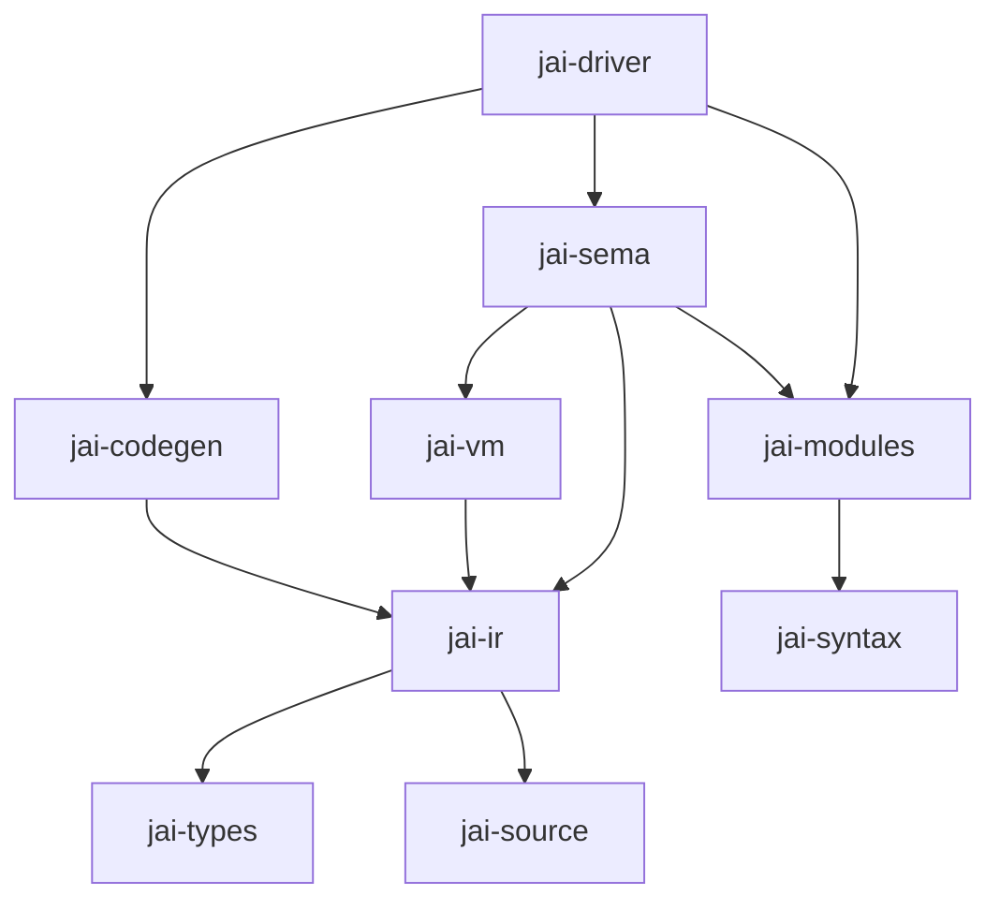

# Compiler architecture

## What it is

An independent Rust implementation targeting Jai source compatibility. Recent upstream applications and libraries refine the older beta 0.2.009 local distribution. The current code is an early compiler stage, **not a complete Jai implementation**.

## How it works

`jai-source` owns source records, byte spans, diagnostics and interned spelling IDs. `jai-types` owns canonical and nominal type identities, checked integer values and explicit target layouts. `jai-lexer` assigns typed token tags, including nested comments and opaque here-strings. Its decoder tolerates legacy non-UTF8 bytes inside comments while preserving byte offsets, and rejects them in code or strings.

`jai-syntax` produces unresolved source syntax. Its independent file parser preserves import forms, source identities and visibility without reading dependencies. `jai-modules` owns the dependency and namespace graph; it resolves declarations rather than changing their spellings. `jai-eval` binds and evaluates pure constants with shared numeric operators. `jai-sema` resolves types, constants, signatures, and storage, then publishes the [checked IR](semantic-ir.md) owned by `jai-ir`.

`jai-vm` executes that IR for compile-time work without native code. `jai-codegen` independently lowers it and verifies an LLVM module through Inkwell. `jai-driver` owns source scheduling, compiler-effect transactions, and trusted LLVM/Clang coordination; `jai-cli` exposes stage commands and native builds; `jai-bench` measures compiler stages.

The dependency direction keeps execution engines below semantic resolution:

Source binding can supply checked ready procedures to the VM before the final type registry freezes. Ready proofs retain their type/signature/storage environment and require no unrelated callee bodies. Final `Library` publication checks every definition and initializer; `Program` additionally checks an executable entry. The VM and LLVM consume the same value, place, result-list, and cleanup representations.

The executable path resolves independent file and module scopes through declaration identities. Imported scalar procedures retain their defining scope, and reexports preserve shared storage. Parsing a module or constructing its scope graph alone does not establish that it compiles. The [type registry](type-registry.md), [layouts](type-layout.md), [module scopes](module-scopes.md), and [scoped semantics](scoped-semantics.md) explain these interfaces.

Boolean parameters/returns use Boolean LLVM values, void procedures emit void calls/returns, and nested `&&`/`||` expressions short-circuit through branches and phi nodes. Integer truthiness and explicit scalar casts are represented in checked IR. Compound assignment preserves scalar types and logical updates short-circuit. Native behavior tests execute only newly generated fixtures with a five-second timeout. See [type safety](type-safety.md) for stage invariants.

Feature support is tracked by each subsystem's source and execution tests. Shared-IR fixtures establish consumer behavior; they do not establish that a reference source program binds or executes. Lexing a reference file does not imply it parses, typechecks, links or runs. No builtin shortcut replaces `Basic` or makes an unimplemented reference program count as successful.

Integer range loops and named loop exits use resolved `LoopId` values and LLVM block handles. Deferred cleanup uses typed cleanup IDs attached to each exit, with return values captured before cleanup. See [deferred cleanup](deferred-cleanup.md). See [loop control](loop-control.md) for endpoint, scope and exit behavior.

## How to change it

Extend tokens and syntax with source-backed tests, prioritizing the [recent upstream corpus](upstream-corpus.md). Add type/lowering support before accepting new syntax as compilable. Extend checked nodes in `jai-ir` and its publication verifier before implementing consumer matches. Keep VM execution independent of semantic binding and LLVM; return readiness dependencies to the semantic scheduler rather than recursing into it from an execution engine. Preserve rejection of unsupported constructs.

Checked integer arithmetic, division, shifts and casts have source, VM and generated-native rejection/parity fixtures. [Safety checks](safety-checks.md) documents their policies: arithmetic-overflow suppression wraps add/subtract/multiply/negation and signed minimum divided by minus one, while division by zero, invalid shift counts and checked casts still enforce their independent checks. These proofs cover the implemented operations rather than every Jai numeric form. Local stack allocations are emitted once in procedure entry blocks, including variables declared inside loops. Internal Boolean representations are not yet a complete foreign ABI implementation.

## Configuration

`cargo run -p jai-cli -- lex file.jai` performs lexical inspection only. `parse file.jai` inspects one file's syntax without loading dependencies. `check`, `emit-llvm`, and `build` use the implemented native subset. `check` does not allocate LLVM output. `build file.jai output` invokes independently installed `clang`; `JAI_RS_CLANG` selects that trusted executable. The CLI resolves the executable path and rejects paths into this checkout's `reference/`.

## Dependencies

The frontend, constant-evaluation and semantic crates use internal crates and Rust's standard library. The backend uses Inkwell and llvm-sys with independently installed LLVM 22. The separate benchmark crate uses Divan. Native builds additionally require trusted Clang and the host SDK/linker. See [LLVM setup](llvm-backend.md). No supplied binary is part of the compiler implementation.
